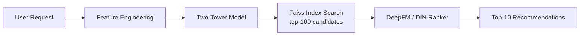

# video-recsys-pipeline

An industrial-grade video recommendation system pipeline, targeting TikTok / JD ML Engineer Intern roles.

Implements the full two-stage recommendation architecture:
**Two-Tower Recall → Faiss Retrieval → DeepFM / DIN Ranking**

Dataset: [KuaiRec](https://kuairec.com/) (real-world short-video interaction data from Kuaishou)

---

## System Architecture



---

## Tech Stack

| Component | Technology |
|-----------|-----------|
| Deep Learning | PyTorch 2.11 + CUDA 12.8 |
| Retrieval Index | Faiss (IVFFlat) |
| Recall Model | Two-Tower (Dual Encoder) |
| Ranking Models | DeepFM, DIN |
| Feature Engineering | Pandas, Scikit-learn |
| Experiment Tracking | TensorBoard |
| Demo | Gradio |

---

## Quick Start

```bash
# 1. Create conda environment (Python 3.10)
conda create -n recsys python=3.10
conda activate recsys

# 2. Install PyTorch (RTX 50-series / Blackwell needs cu128)
pip install torch torchvision --index-url https://download.pytorch.org/whl/cu128

# 3. Install remaining dependencies
pip install -r requirements.txt

# 4. Generate mock data (KuaiRec schema)
python src/data/download_data.py

# 5. Train retrieval model
python src/training/train_retrieval.py

# 6. Train ranking model
python src/training/train_ranking.py

# 7. Run full pipeline
python main.py --user_id 123

# 8. Launch demo
python demo/app.py
```

---

## Project Structure

```
video-recsys-pipeline/
├── src/
│   ├── data/           # Feature engineering, dataset, data download
│   ├── models/         # Two-Tower, DeepFM, DIN
│   ├── retrieval/      # Faiss index build & search
│   ├── training/       # Trainer, train_retrieval, train_ranking
│   ├── evaluation/     # Recall@K, NDCG@K, AUC, GAUC
│   └── utils/          # Logger, GPU utils
├── configs/            # YAML hyperparameter configs
├── experiments/        # Checkpoints, TensorBoard logs, results
├── notebooks/          # EDA.ipynb
├── demo/               # Gradio web demo
├── docs/               # LEARNING_GUIDE.md (deep-dive documentation)
└── tests/              # Unit & integration tests
```

---

## Experiment Results

*(To be filled after Iteration 3)*

| Model | Recall@10 | Recall@50 | AUC | GAUC |
|-------|-----------|-----------|-----|------|
| Two-Tower | - | - | - | - |
| DeepFM | - | - | - | - |
| DIN | - | - | - | - |

---

## Documentation

See [docs/LEARNING_GUIDE.md](docs/LEARNING_GUIDE.md) for a comprehensive deep-dive guide covering:
- System architecture and design decisions
- Model theory with math derivations
- Interview Q&A (TikTok / JD style)
- Ablation study analysis

---

## References

- [KuaiRec: A Fully-Observed Dataset for Recommender Systems (CIKM 2022)](https://kuairec.com/)
- [Real-time Personalization using Embeddings for Search Ranking at Airbnb (KDD 2018)](https://arxiv.org/abs/1810.09591) — Two-Tower origin
- [DeepFM: A Factorization-Machine based Neural Network for CTR Prediction (IJCAI 2017)](https://arxiv.org/abs/1703.04247)
- [Deep Interest Network for Click-Through Rate Prediction (KDD 2018)](https://arxiv.org/abs/1706.06978)
- [Billion-scale Commodity Embedding for E-commerce Recommendation in Alibaba (KDD 2018)](https://arxiv.org/abs/1803.02349)
