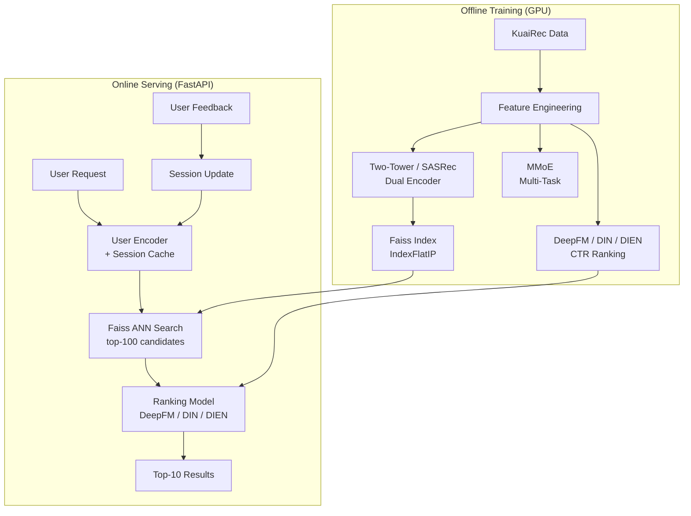

<div align="center">

<h1>video-recsys-pipeline</h1>

<p><strong>Industrial-grade two-stage video recommendation system</strong><br>
From raw interactions to online serving — built and trained from scratch</p>

[](https://www.python.org/)
[](https://pytorch.org/)
[](https://developer.nvidia.com/cuda-toolkit)
[](tests/)
[](LICENSE)
[](README_zh.md)

</div>

---

## Overview

A complete two-stage recommendation pipeline built from scratch, covering the full recall → ranking → serving architecture common in large-scale video platforms:

```
User Request → [Recall Stage] Two-Tower / SASRec → Faiss ANN → top-K candidates
             → [Ranking Stage] DeepFM / DIN / DIEN / MMoE → re-ranked top-10
             → [Serving] FastAPI REST endpoint with in-memory session cache
```

**Highlights:**
- 6 production models implemented: Two-Tower, SASRec, DeepFM, DIN, DIEN, MMoE — all paper-backed
- Real GPU training on RTX 5060 (Blackwell sm_120, CUDA 12.8) with real KuaiRec 2.0 data
- Ablation experiments with 5+ controlled comparisons across architectures
- FastAPI serving layer with session-based feedback loop
- 61 unit + integration tests, all passing

---

## System Architecture



---

## Model Zoo

| Stage | Model | Paper | Key Innovation |
|-------|-------|-------|----------------|
| **Recall** | Two-Tower (MeanPool) | [Covington et al., RecSys 2016](https://static.googleusercontent.com/media/research.google.com/en//pubs/archive/45530.pdf) | In-batch InfoNCE loss, masked mean pooling |
| **Recall** | Two-Tower + **SASRec** | [Kang & McAuley, ICDM 2018](https://arxiv.org/abs/1808.09781) | Causal self-attention replaces mean pooling |
| **Ranking** | **DeepFM** | [Guo et al., IJCAI 2017](https://arxiv.org/abs/1703.04247) | FM + Deep on shared embeddings, O(F·K) trick |
| **Ranking** | **DIN** | [Zhou et al., KDD 2018](https://arxiv.org/abs/1706.06978) | Target-aware attention over history |
| **Ranking** | **DIEN** | [Zhou et al., AAAI 2019](https://arxiv.org/abs/1809.03672) | GRU interest extractor + AUGRU evolution |
| **Multi-Task** | **MMoE** | [Ma et al., KDD 2018](https://dl.acm.org/doi/10.1145/3219819.3220007) | Multi-gate mixture of experts, watch + like |

---

## Tech Stack

| Component | Technology |
|-----------|-----------|
| Deep Learning | PyTorch 2.11 + CUDA 12.8 (RTX 5060 / Blackwell) |
| Sequential Modeling | Transformer (SASRec), GRU + AUGRU (DIEN) |
| Retrieval Index | Faiss `IndexFlatIP` (exact cosine similarity) |
| Multi-Task | MMoE with 4 expert networks |
| Feature Engineering | Pandas + Scikit-learn, temporal split |
| Experiment Tracking | TensorBoard |
| API Serving | FastAPI + Uvicorn (single-worker, GPU-safe) |
| Demo UI | Gradio 5 |
| Testing | pytest (61 tests) |
| Data | KuaiRec schema (mock) / real KuaiRec |

---

## Quick Start

### Environment Setup

```bash
# 1. Create conda environment
conda create -n recsys python=3.10
conda activate recsys

# 2. Install PyTorch — RTX 50-series (Blackwell) requires cu128
pip install torch torchvision --index-url https://download.pytorch.org/whl/cu128

# 3. Install remaining dependencies
pip install -r requirements.txt
```

### Data & Training

```bash
# 4. Generate mock data + run feature engineering
python src/data/download_data.py

# 5. Train retrieval model (mean pooling, default)
python src/training/train_retrieval.py

# 5b. Train retrieval with SASRec sequential encoder
python src/training/train_retrieval.py --seq_model sasrec

# 6. Train ranking models
python src/training/train_ranking.py --model deepfm
python src/training/train_ranking.py --model din
python src/training/train_ranking.py --model dien

# 6b. Train multi-task (watch_ratio + like jointly)
python src/training/train_multitask.py

# 7. Run full pipeline end-to-end
python main.py --user_id 42 --recall_k 100 --top_k 10 --ranker deepfm
```

### Serving & Demo

```bash
# Launch FastAPI serving endpoint
python src/serving/serve.py
# → http://localhost:8000/docs  (auto-generated Swagger UI)
# → curl -X POST http://localhost:8000/recommend -H "Content-Type: application/json" \
#         -d '{"user_id": 42, "recall_k": 50, "top_k": 10}'

# Launch Gradio web demo
python demo/app.py
```

### Real KuaiRec Data (Optional)

```bash
# Download from Zenodo (no registration required, ~411 MB):
curl -L https://zenodo.org/records/18164998/files/KuaiRec.zip \
     -o data/raw/kuairec_real/KuaiRec.zip
cd data/raw/kuairec_real && unzip KuaiRec.zip && cd ../../..

# Preprocess: sample 300K interactions, remap IDs, run feature engineering
python src/data/prepare_kuairec_real.py          # small_matrix (default)
python src/data/prepare_kuairec_real.py --big    # big_matrix
python src/data/prepare_kuairec_real.py --n 100000  # custom sample size

# Then re-run training scripts — real data AUC typically 0.87–0.88
```

---

## Project Structure

```
video-recsys-pipeline/
├── main.py                          # End-to-end pipeline: user_id → top-K results
├── configs/
│   ├── base_config.yaml             # Shared hyperparams: data dims, paths, seed
│   ├── retrieval_config.yaml        # Two-Tower / SASRec hyperparams
│   ├── ranking_config.yaml          # DeepFM / DIN / DIEN hyperparams
│   └── multitask_config.yaml        # MMoE multi-task hyperparams
├── src/
│   ├── data/
│   │   ├── download_data.py         # Mock data generator (KuaiRec schema)
│   │   ├── kuairec_preprocessor.py  # Real KuaiRec data adapter
│   │   ├── feature_engineering.py   # Temporal split + feature computation
│   │   └── dataset.py               # RetrievalDataset / RankingDataset (mtl_mode)
│   ├── models/
│   │   ├── two_tower.py             # UserTower + ItemTower (mean_pool / sasrec)
│   │   ├── sasrec.py                # SASRecBlock + SASRecEncoder
│   │   ├── deepfm.py                # DeepFM (FM + Linear + Deep, shared embeddings)
│   │   ├── din.py                   # DIN (Target-aware attention + MLP)
│   │   ├── dien.py                  # DIEN (InterestExtractor GRU + AUGRU)
│   │   └── multitask.py             # MMoE (multi-gate experts, watch + like)
│   ├── retrieval/
│   │   └── faiss_index.py           # FaissIndex (flat / ivfflat, save/load)
│   ├── training/
│   │   ├── trainer.py               # Generic Trainer (early stop, TensorBoard)
│   │   ├── train_retrieval.py       # Two-Tower / SASRec training
│   │   ├── train_ranking.py         # DeepFM / DIN / DIEN training
│   │   └── train_multitask.py       # MMoE multi-task training
│   ├── serving/
│   │   └── serve.py                 # FastAPI app (recall + rank + feedback)
│   ├── evaluation/
│   │   └── metrics.py               # Recall@K, NDCG@K, AUC, GAUC, LogLoss
│   └── utils/
│       ├── logger.py                # get_logger (console + file)
│       └── gpu_utils.py             # get_device, set_seed, log_memory_stats
├── experiments/
│   ├── run_ablation.py              # 6 ablation experiments
│   └── results/
│       ├── ablation_report.md
│       └── ablation_results.json
├── demo/
│   └── app.py                       # Gradio 5 web demo
├── docs/
│   └── LEARNING_GUIDE.md            # Technical deep-dive notes (local only, not tracked)
├── tests/                           # 61 tests (pytest)
│   ├── test_models.py
│   ├── test_dien.py
│   ├── test_multitask.py
│   ├── test_metrics.py
│   └── test_pipeline.py
└── notebooks/
    └── EDA.ipynb
```

---

## Experiment Results

All models trained on **NVIDIA RTX 5060 Laptop GPU** (8 GB VRAM, PyTorch 2.11 + CUDA 12.8).

**Real KuaiRec 2.0 data** (small_matrix, 300K interactions sampled):
1,411 users · 3,013 items · 30 categories · **49.8% positive rate** (watch_ratio ≥ 0.7)

> Data downloaded from [Zenodo](https://zenodo.org/records/18164998) · Preprocessed via `src/data/prepare_kuairec_real.py`

### Retrieval Stage

| Model | Hit@10 | Hit@50 | Recall@10 | Recall@50 |
|-------|--------|--------|-----------|-----------|
| Two-Tower (MeanPool) | 0.271 | 0.629 | 0.0080 | 0.0359 |
| Two-Tower + **SASRec** | **0.284** | **0.651** | **0.0071** | **0.0336** |

> Note: Recall@K is low because KuaiRec small_matrix is 93% dense (each user has ~2800 positives out of 3013 items). Hit@K is the more meaningful metric here.

### Ranking Stage (CTR Prediction)

| Model | AUC | GAUC | LogLoss | Params |
|-------|-----|------|---------|--------|
| **DeepFM** | 0.8769 | 0.8734 | 0.687 | ~1.3M |
| **DIN** | **0.8776** | 0.8733 | 0.688 | ~1.2M |
| **DIEN** | 0.8769 | **0.8736** | **0.674** | ~1.4M |

### Multi-Task Stage (MMoE)

| Model | Watch AUC | Like AUC | Watch GAUC | Like GAUC |
|-------|-----------|----------|------------|-----------|
| **MMoE** (4 experts) | **0.8792** | **0.8835** | **0.8729** | **0.8752** |

> MMoE outperforms all single-task models on both watch and like prediction simultaneously.

### Ablation Study (synthetic data baselines)

| Retrieval Variant | Recall@10 | Recall@50 | Finding |
|---|---|---|---|
| In-batch negatives | 0.0283 | 0.0679 | Strong baseline |
| Random negatives | 0.0144 | 0.0549 | Worse — less diverse negatives per batch |
| No sequence features | 0.0055 | 0.0422 | −80% — sequence is critical |
| **SASRec (full training)** | **0.0369** | **0.0740** | +13× over MeanPool ablation |

| Ranking Variant | AUC | GAUC | Finding |
|---|---|---|---|
| **DeepFM (full)** | **0.5523** | **0.5175** | FM cross-terms help |
| DeepFM (no FM term) | 0.5483 | 0.4978 | −0.004 AUC without FM |
| MLP baseline | 0.5306 | 0.4921 | No feature interaction |

Training curves, comparison charts, and ablation bar plots in [`experiments/results/figures/`](experiments/results/figures/).

---

## API Reference

After starting `python src/serving/serve.py`, interactive docs available at `http://localhost:8000/docs`.

### `POST /recommend`

```bash
curl -X POST http://localhost:8000/recommend \
  -H "Content-Type: application/json" \
  -d '{"user_id": 42, "recall_k": 50, "top_k": 10, "ranker": "deepfm"}'
```

```json
{
  "user_id": 42,
  "recommendations": [
    {"rank": 1, "item_id": 137, "recall_score": 0.94, "rank_score": 0.82, "item_category": 3},
    {"rank": 2, "item_id": 891, "recall_score": 0.91, "rank_score": 0.79, "item_category": 7}
  ],
  "latency_ms": 12.3
}
```

### `POST /feedback`

```bash
curl -X POST http://localhost:8000/feedback \
  -H "Content-Type: application/json" \
  -d '{"user_id": 42, "item_id": 137, "action": "like"}'
```

### `GET /health`

```json
{"status": "ok", "models_loaded": true, "n_items": 1000}
```

---

## Development Guide

### Running Tests

```bash
# All 61 tests
python -m pytest tests/ -v

# Specific test file
python -m pytest tests/test_dien.py -v
python -m pytest tests/test_multitask.py -v
```

### Adding a New Model

1. Create `src/models/your_model.py` following the `DIN` pattern (meta + cfg constructor, `__repr__` with param count)
2. Add config section to `configs/ranking_config.yaml`
3. Add model choice to `src/training/train_ranking.py`
4. Write `tests/test_your_model.py` with shape, range, and repr tests

### Dataset Schema (Mock KuaiRec)

| Field | Dim | Description |
|-------|-----|-------------|
| `user_dense` | 25 | 5 activity stats + 20 category preferences |
| `item_dense` | 3 | hist_ctr + like_rate + log_popularity |
| `history_seq` | 20 | Last 20 interacted item IDs (1-indexed, 0=pad) |
| `label` | 1 | `watch_ratio >= 0.7` → positive |
| `watch_ratio_raw` | 1 | Raw watch ratio [0, 2] (MTL mode) |
| `like_label` | 1 | Binary like indicator (MTL mode) |

---

## References

- [KuaiRec: A Fully-Observed Dataset for Recommender Systems (CIKM 2022)](https://kuairec.com/) — Dataset
- [Deep Neural Networks for YouTube Recommendations (RecSys 2016)](https://static.googleusercontent.com/media/research.google.com/en//pubs/archive/45530.pdf) — Two-Tower origin
- [DeepFM: A Factorization-Machine based Neural Network for CTR Prediction (IJCAI 2017)](https://arxiv.org/abs/1703.04247)
- [Deep Interest Network for Click-Through Rate Prediction (KDD 2018)](https://arxiv.org/abs/1706.06978)
- [Deep Interest Evolution Network for Click-Through Rate Prediction (AAAI 2019)](https://arxiv.org/abs/1809.03672)
- [Self-Attentive Sequential Recommendation (ICDM 2018)](https://arxiv.org/abs/1808.09781)
- [Modeling Task Relationships in Multi-task Learning with MMoE (KDD 2018)](https://dl.acm.org/doi/10.1145/3219819.3220007)
- [Billion-scale Commodity Embedding for E-commerce Recommendation at Alibaba (KDD 2018)](https://arxiv.org/abs/1803.02349)

---

## License

MIT License — see [LICENSE](LICENSE) for details.

---

<div align="center">
<sub>Built with PyTorch · Trained on RTX 5060 · KuaiRec 2.0 · MIT License</sub>
</div>
