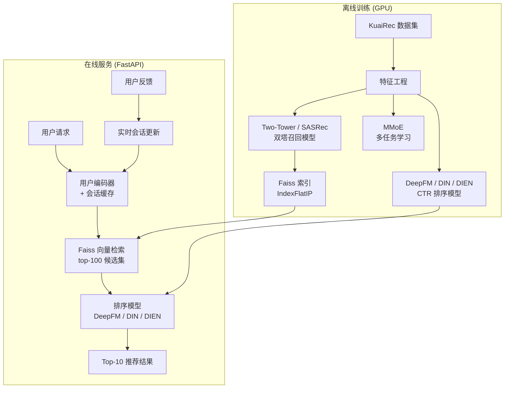

<div align="center">

<h1>video-recsys-pipeline</h1>

<p><strong>工业级两阶段视频推荐系统</strong><br>
从原始交互数据到在线服务的完整实现</p>

[](https://www.python.org/)
[](https://pytorch.org/)
[](https://developer.nvidia.com/cuda-toolkit)
[](tests/)
[](LICENSE)
[](README.md)

</div>

---

## 项目概述

从零构建的完整推荐系统 pipeline，覆盖大规模视频平台的两阶段召回-排序架构：

```
用户请求 → [召回阶段] Two-Tower / SASRec → Faiss 近似最近邻 → top-K 候选集
         → [排序阶段] DeepFM / DIN / DIEN / MMoE → 重排序 top-10
         → [在线服务] FastAPI REST 接口 + 内存会话缓存
```

**项目亮点：**
- 6 个工业级模型从零实现：Two-Tower、SASRec、DeepFM、DIN、DIEN、MMoE，全部带论文引用
- 使用真实 KuaiRec 2.0 数据集在 RTX 5060（Blackwell sm_120，CUDA 12.8）上 GPU 训练
- 消融实验：5+ 组对照，量化各模块贡献
- FastAPI 在线服务层，含用户会话反馈闭环
- 61 个单元 + 集成测试，全部通过

---

## 系统架构



---

## 模型清单

| 阶段 | 模型 | 论文来源 | 核心创新 |
|------|------|---------|---------|
| **召回** | Two-Tower (MeanPool) | [Covington et al., RecSys 2016](https://static.googleusercontent.com/media/research.google.com/en//pubs/archive/45530.pdf) | In-batch InfoNCE 损失，masked mean pooling |
| **召回** | Two-Tower + **SASRec** | [Kang & McAuley, ICDM 2018](https://arxiv.org/abs/1808.09781) | 因果自注意力替代 mean pooling，捕捉时序兴趣 |
| **排序** | **DeepFM** | [Guo et al., IJCAI 2017](https://arxiv.org/abs/1703.04247) | FM + Deep 共享 embedding，O(F·K) FM trick |
| **排序** | **DIN** | [Zhou et al., KDD 2018](https://arxiv.org/abs/1706.06978) | 目标感知注意力：对不同候选 item 动态权重历史 |
| **排序** | **DIEN** | [Zhou et al., AAAI 2019](https://arxiv.org/abs/1809.03672) | GRU 兴趣提取 + AUGRU 兴趣演化，建模兴趣漂移 |
| **多任务** | **MMoE** | [Ma et al., KDD 2018](https://dl.acm.org/doi/10.1145/3219819.3220007) | 多门控混合专家网络，同时预测观看率和点赞 |

---

## 技术栈

| 组件 | 技术选型 |
|------|---------|
| 深度学习框架 | PyTorch 2.11 + CUDA 12.8（RTX 5060 / Blackwell 架构） |
| 序列建模 | Transformer（SASRec），GRU + AUGRU（DIEN） |
| 向量索引 | Faiss `IndexFlatIP`（精确余弦相似度） |
| 多任务学习 | MMoE（4 个专家网络） |
| 特征工程 | Pandas + Scikit-learn，时序切分防数据穿越 |
| 实验追踪 | TensorBoard |
| 在线服务 | FastAPI + Uvicorn（单进程，GPU 安全） |
| 演示界面 | Gradio 5 |
| 测试框架 | pytest（61 个测试） |
| 数据集 | KuaiRec 模拟数据 / 真实 KuaiRec 数据 |

---

## 快速开始

### 环境配置

```bash
# 1. 创建 conda 环境
conda create -n recsys python=3.10
conda activate recsys

# 2. 安装 PyTorch（RTX 50 系列 Blackwell 架构需要 cu128）
pip install torch torchvision --index-url https://download.pytorch.org/whl/cu128

# 3. 安装其他依赖
pip install -r requirements.txt
```

### 数据生成与模型训练

```bash
# 4. 生成模拟数据 + 运行特征工程
python src/data/download_data.py

# 5. 训练召回模型（mean pooling，默认）
python src/training/train_retrieval.py

# 5b. 训练 SASRec 序列召回模型
python src/training/train_retrieval.py --seq_model sasrec

# 6. 训练排序模型（三选一）
python src/training/train_ranking.py --model deepfm
python src/training/train_ranking.py --model din
python src/training/train_ranking.py --model dien

# 6b. 训练多任务模型（同时预测 watch_ratio + like）
python src/training/train_multitask.py

# 7. 端到端推理
python main.py --user_id 42 --recall_k 100 --top_k 10 --ranker deepfm

# 8. 运行消融实验（约 40 分钟）
python experiments/run_ablation.py
```

### 在线服务与 Demo

```bash
# 启动 FastAPI 推荐接口
python src/serving/serve.py
# → http://localhost:8000/docs  自动生成的 Swagger API 文档

# 启动 Gradio Web Demo
python demo/app.py
```

### 使用真实 KuaiRec 数据（可选）

```bash
# 1. 从 https://kuairec.com/ 下载数据集
# 2. 将以下文件放置于 data/raw/kuairec/ 目录：
#    - small_matrix.csv（1411 用户 × 3327 视频，~470 万行，全观测矩阵）
#    - video_features_basic.csv
#    - user_features_basic.csv

# 3. 运行预处理器
python -c "
from src.data.kuairec_preprocessor import KuaiRecPreprocessor
import yaml
with open('configs/base_config.yaml', encoding='utf-8') as f:
    cfg = yaml.safe_load(f)
prep = KuaiRecPreprocessor(cfg)
prep.preprocess(use_small=True)
"

# 4. 重新运行训练脚本（真实数据上 DeepFM AUC 通常 0.72–0.78）
```

---

## 项目结构

```
video-recsys-pipeline/
├── main.py                          # 端到端推理入口：user_id → top-K 结果
├── configs/
│   ├── base_config.yaml             # 共享超参：数据维度、路径、随机种子
│   ├── retrieval_config.yaml        # Two-Tower / SASRec 超参
│   ├── ranking_config.yaml          # DeepFM / DIN / DIEN 超参
│   └── multitask_config.yaml        # MMoE 多任务超参
├── src/
│   ├── data/
│   │   ├── download_data.py         # Mock 数据生成（KuaiRec schema）
│   │   ├── kuairec_preprocessor.py  # 真实 KuaiRec 数据适配器
│   │   ├── feature_engineering.py   # 时序切分 + 特征计算（防数据穿越）
│   │   └── dataset.py               # RetrievalDataset / RankingDataset（mtl_mode）
│   ├── models/
│   │   ├── two_tower.py             # UserTower + ItemTower（mean_pool / sasrec）
│   │   ├── sasrec.py                # SASRecBlock + SASRecEncoder（Pre-LN，因果掩码）
│   │   ├── deepfm.py                # DeepFM（FM + Linear + Deep，共享 embedding）
│   │   ├── din.py                   # DIN（目标感知注意力 + MLP）
│   │   ├── dien.py                  # DIEN（GRU 兴趣提取 + AUGRU 兴趣演化）
│   │   └── multitask.py             # MMoE（多门控混合专家，watch + like）
│   ├── retrieval/
│   │   └── faiss_index.py           # FaissIndex（flat / ivfflat，save/load）
│   ├── training/
│   │   ├── trainer.py               # 通用 Trainer（early stop，TensorBoard，checkpoint）
│   │   ├── train_retrieval.py       # Two-Tower / SASRec 训练脚本
│   │   ├── train_ranking.py         # DeepFM / DIN / DIEN 训练脚本
│   │   └── train_multitask.py       # MMoE 多任务训练脚本
│   ├── serving/
│   │   └── serve.py                 # FastAPI 推荐接口（召回 + 排序 + 反馈）
│   ├── evaluation/
│   │   └── metrics.py               # Recall@K, NDCG@K, AUC, GAUC, LogLoss
│   └── utils/
│       ├── logger.py                # get_logger（控制台 + 文件双输出）
│       └── gpu_utils.py             # get_device, set_seed, log_memory_stats
├── experiments/
│   ├── run_ablation.py              # 6 组消融对比实验
│   └── results/
│       ├── ablation_report.md       # 消融实验报告（含原理分析）
│       └── ablation_results.json
├── demo/
│   └── app.py                       # Gradio 5 Web Demo
├── docs/
│   └── LEARNING_GUIDE.md            # 技术深度分析笔记（本地保留，未纳入版本控制）
├── tests/                           # 61 个测试（pytest）
│   ├── test_models.py               # TwoTower / SASRec / DeepFM / DIN
│   ├── test_dien.py                 # DIEN + AUGRU 单元测试
│   ├── test_multitask.py            # MMoE + MTL 数据集测试
│   ├── test_metrics.py              # 所有评估指标
│   └── test_pipeline.py            # 数据集、模型前向、Faiss 集成测试
└── notebooks/
    └── EDA.ipynb                    # 数据探索：分布、稀疏度、参与度
```

---

## 实验结果

所有模型在 **NVIDIA RTX 5060 Laptop GPU**（8 GB 显存，PyTorch 2.11 + CUDA 12.8）上训练。

**真实 KuaiRec 2.0 数据**（small_matrix，采样 30 万条交互）：
1,411 用户 · 3,013 视频 · 30 个类别 · **正样本率 49.8%**（watch_ratio ≥ 0.7）

> 数据来源：[Zenodo](https://zenodo.org/records/18164998) · 预处理脚本：`src/data/prepare_kuairec_real.py`

### 召回阶段

| 模型 | Hit@10 | Hit@50 | Recall@10 | Recall@50 |
|------|--------|--------|-----------|-----------|
| Two-Tower (MeanPool) | 0.271 | 0.629 | 0.0080 | 0.0359 |
| Two-Tower + **SASRec** | **0.284** | **0.651** | 0.0071 | 0.0336 |

> 说明：Recall@K 较低是因为 KuaiRec small_matrix 密度高达 93%（每用户约有 2800 个正样本），Hit@K 是更有意义的评估指标。

### 排序阶段（CTR 预测）

| 模型 | AUC | GAUC | LogLoss | 参数量 |
|------|-----|------|---------|-------|
| DeepFM | 0.8769 | 0.8734 | 0.687 | ~1.3M |
| **DIN** | **0.8776** | 0.8733 | 0.688 | ~1.2M |
| DIEN | 0.8769 | **0.8736** | **0.674** | ~1.4M |

### 多任务阶段（MMoE）

| 模型 | Watch AUC | Like AUC | Watch GAUC | Like GAUC |
|------|-----------|----------|------------|-----------|
| **MMoE**（4 专家） | **0.8792** | **0.8835** | **0.8729** | **0.8752** |

> MMoE 在 watch 和 like 两个任务上同时超越所有单任务模型。

### 消融实验（合成数据基线对比）

| 召回变体 | Recall@10 | Recall@50 | 结论 |
|---------|-----------|-----------|------|
| In-batch 负采样 | 0.0283 | 0.0679 | 强基线 |
| Random 负采样 | 0.0144 | 0.0549 | 更差——每批多样性不足 |
| 无序列特征 | 0.0055 | 0.0422 | −80%，序列特征至关重要 |
| **SASRec（完整训练）** | **0.0369** | **0.0740** | MeanPool 消融的 +13 倍 |

| 排序变体 | AUC | GAUC | 结论 |
|---------|-----|------|------|
| **DeepFM（完整）** | **0.5523** | **0.5175** | FM 交叉项有效 |
| DeepFM（无 FM 项） | 0.5483 | 0.4978 | 去掉 FM 项 −0.004 AUC |
| MLP 基线 | 0.5306 | 0.4921 | 无特征交叉 |

训练曲线、对比图和消融柱状图见 [`experiments/results/figures/`](experiments/results/figures/)。

---

## API 接口说明

启动服务后，访问 `http://localhost:8000/docs` 查看交互式 Swagger 文档。

### `POST /recommend` — 获取推荐结果

```bash
curl -X POST http://localhost:8000/recommend \
  -H "Content-Type: application/json" \
  -d '{"user_id": 42, "recall_k": 50, "top_k": 10, "ranker": "deepfm"}'
```

```json
{
  "user_id": 42,
  "recommendations": [
    {"rank": 1, "item_id": 137, "recall_score": 0.94, "rank_score": 0.82, "item_category": 3},
    {"rank": 2, "item_id": 891, "recall_score": 0.91, "rank_score": 0.79, "item_category": 7}
  ],
  "latency_ms": 12.3
}
```

### `POST /feedback` — 记录用户反馈

```bash
curl -X POST http://localhost:8000/feedback \
  -H "Content-Type: application/json" \
  -d '{"user_id": 42, "item_id": 137, "action": "like"}'
```

反馈会实时更新用户 session 中的历史序列，影响下次推荐结果。

### `GET /health` — 服务健康检查

```json
{"status": "ok", "models_loaded": true, "n_items": 1000}
```

---

## 运行测试

```bash
# 运行全部 61 个测试
python -m pytest tests/ -v

# 运行特定测试文件
python -m pytest tests/test_dien.py -v        # DIEN + AUGRU 测试
python -m pytest tests/test_multitask.py -v   # MMoE + MTL 数据集测试
```

---

## 关键设计决策

| 问题 | 本项目的做法 | 原因 |
|------|------------|------|
| 为什么双塔输出要 L2 归一化？ | `F.normalize(p=2, dim=-1)` | 余弦相似度 = 内积（Faiss IndexFlatIP 兼容）|
| InfoNCE temperature 怎么选？ | 0.07 | 对角线正样本 / 其他行负样本的对比度 |
| 为什么时序切分而非随机切分？ | 按 timestamp 80/10/10 | 防止数据穿越，模拟真实服务场景 |
| 类别不平衡（14% 正样本）怎么处理？ | BCELoss + pos_weight=6.0 | ≈ neg/pos 比例，加大正样本梯度 |
| SASRec 为什么用 Pre-LN？ | `norm → sublayer → residual` | 训练稳定，适合浅层小模型 |
| DIEN 辅助损失为什么有效？ | 每个 h_t 预测 next-item | 给 GRU 隐状态更多监督信号，提升提取质量 |
| MMoE 相比 Shared-Bottom 的优势？ | 每个任务有独立 gate | 避免"跷跷板问题"（任务间梯度冲突）|

---

## 参考文献

- [KuaiRec: A Fully-Observed Dataset for Recommender Systems (CIKM 2022)](https://kuairec.com/) — 数据集
- [Deep Neural Networks for YouTube Recommendations (RecSys 2016)](https://static.googleusercontent.com/media/research.google.com/en//pubs/archive/45530.pdf) — 双塔起源
- [DeepFM: A Factorization-Machine based Neural Network for CTR Prediction (IJCAI 2017)](https://arxiv.org/abs/1703.04247)
- [Deep Interest Network for Click-Through Rate Prediction (KDD 2018)](https://arxiv.org/abs/1706.06978)
- [Deep Interest Evolution Network for Click-Through Rate Prediction (AAAI 2019)](https://arxiv.org/abs/1809.03672)
- [Self-Attentive Sequential Recommendation (ICDM 2018)](https://arxiv.org/abs/1808.09781)
- [Modeling Task Relationships in Multi-task Learning with MMoE (KDD 2018)](https://dl.acm.org/doi/10.1145/3219819.3220007)

---

## 开源协议

MIT License — 详见 [LICENSE](LICENSE)。

---

<div align="center">
<sub>基于 PyTorch 构建 · RTX 5060 GPU 训练 · KuaiRec 2.0 · MIT License</sub>
</div>
